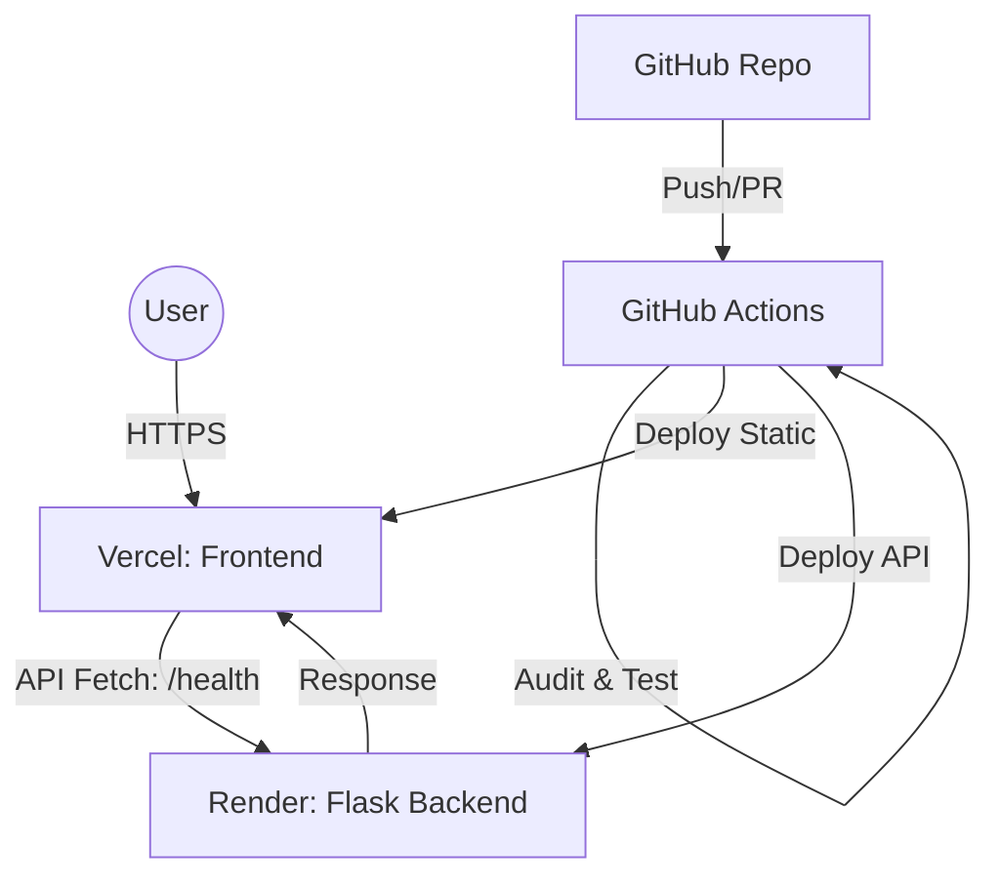

# Smart Health Check – CI/CD Demo

[](https://github.com/Parthiv19M/Smart-health-check-CI-CD/actions)
[](https://www.python.org/downloads/)
[](https://github.com/psf/black)

A modern Python Flask application demonstrating industry-standard CI/CD practices with GitHub Actions, automated testing, and a decoupled production architecture.

## 🏗️ Production Architecture

This project is designed for a modern DevOps workflow where the frontend and backend are decoupled:

- **Frontend**: Hosted on **Vercel** (Static Site).
- **Backend API**: Hosted on **Render** (Python/Flask Web Service).
- **CI/CD**: Fully automated via **GitHub Actions**.

### Architecture Diagram


## 🌐 Live URLs
- **Frontend (Vercel)**: [https://smart-health-check-ci-cd.vercel.app](https://smart-health-check-ci-cd.vercel.app)
- **Backend API (Render)**: [https://smart-health-check-api.onrender.com/health](https://smart-health-check-api.onrender.com/health)

---

## 🚀 Key Features

- **Automated Testing**: Robust test suite with Pytest and Coverage.
- **Code Quality**: Pre-commit hooks for Black, Flake8, and isort.
- **Security**: Vulnerability scanning with Bandit and Safety.
- **CORS Enabled**: Backend is configured to support cross-domain requests.
- **Micro-Frontend Ready**: Static UI calls the API asynchronously.

---

## 🛠️ Quick Start (Local Development)

1. **Clone & Setup**
   ```bash
   git clone https://github.com/Parthiv19M/Smart-health-check-CI-CD.git
   cd Smart-health-check-CI-CD
   python3 -m venv venv && source venv/bin/activate
   pip install -r requirements.txt -r requirements-dev.txt
   pre-commit install
   ```

2. **Run Locally**
   ```bash
   python app.py
   ```
   - UI: `http://localhost:5001/`
   - API: `http://localhost:5001/health`

---

## 🧪 Testing & Linting

```bash
# Run tests
pytest --cov=.

# Run linting manually
pre-commit run --all-files
```

---

## 🚀 Deployment Instructions

### 1. Backend (Render)
1. Create a **New Web Service** on Render.
2. Connect this GitHub repository.
3. Settings:
   - **Runtime**: `Python 3`
   - **Build Command**: `pip install -r requirements.txt`
   - **Start Command**: `gunicorn app:app`
4. Add Environment Variable: `PORT` (Render sets this automatically).

### 2. Frontend (Vercel)
1. Create a **New Project** on Vercel.
2. Connect this GitHub repository.
3. Settings:
   - **Framework Preset**: `Other`
   - **Output Directory**: `static`
4. Vercel automatically detects the `vercel.json` and serves the static files.

---

## 👨‍💻 Authors
- [Parthiv Meduri](https://github.com/Parthiv19M)
- [KL Saketh](https://github.com/klsaketh7-psl)

## 📄 License
This project is licensed under the MIT License - see the [LICENSE](LICENSE) file for details.
